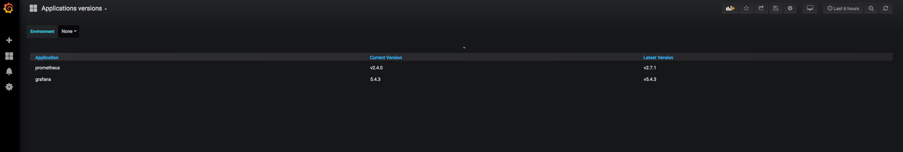

# versions_exporter

This exporter takes the current version of an app in k8s, gets the latest release from github, and expose them in prometheus format metrics.

It scans pods for an annotation that specifies the github org/repo.

In case of a single container pod, the `VERSIONS_EXPORTER_ANNOTATION_NAME` configuration will be used. If you have a pod with multiple containers, you need to use a custom annotation:

```yaml
versions-exporter/<name of the container>: <github repo>
```

For example, if you have a pod with two containers:

```yaml
apiVersion: v1
kind: Pod
metadata:
  annotations:
    versions-exporter/prometheus-server: prometheus/prometheus
  name: monitoring-prometheus-server-7f565bd95d-f4rjg
spec:
  containers:
  - args:
    - --volume-dir=/etc/config
    - --webhook-url=http://127.0.0.1:9090/-/reload
    image: jimmidyson/configmap-reload:v0.2.2
    name: prometheus-server-configmap-reload
    volumeMounts:
    - mountPath: /etc/config
      name: config-volume
      readOnly: true
    - mountPath: /var/run/secrets/kubernetes.io/serviceaccount
      name: monitoring-prometheus-server-token-qtfhb
      readOnly: true
  - args:
    - --storage.tsdb.retention.time=4h
    - --config.file=/etc/config/prometheus.yml
    - --storage.tsdb.path=/data
    - --web.console.libraries=/etc/prometheus/console_libraries
    - --web.console.templates=/etc/prometheus/consoles
    - --web.enable-lifecycle
    - --log.level=debug
    - --storage.tsdb.max-block-duration=2h
    - --storage.tsdb.min-block-duration=2h
    image: prom/prometheus:v2.10.0
    livenessProbe:
      failureThreshold: 3
      httpGet:
        path: /-/healthy
        port: 9090
        scheme: HTTP
      initialDelaySeconds: 30
      periodSeconds: 10
      successThreshold: 1
      timeoutSeconds: 30
    name: prometheus-server
    ports:
    - containerPort: 9090
      protocol: TCP
    readinessProbe:
      failureThreshold: 3
      httpGet:
        path: /-/ready
        port: 9090
        scheme: HTTP
      initialDelaySeconds: 30
      periodSeconds: 10
      successThreshold: 1
      timeoutSeconds: 30
    resources:
      limits:
        cpu: 300m
        memory: 3500Mi
      requests:
        cpu: 100m
        memory: 3000Mi
    volumeMounts:
    - mountPath: /etc/config
      name: config-volume
    - mountPath: /data
      name: storage-volume
    - mountPath: /etc/prometheus-shared
      name: prometheus-config-shared
    - mountPath: /var/run/secrets/kubernetes.io/serviceaccount
      name: monitoring-prometheus-server-token-qtfhb
      readOnly: true
  volumes:
  - configMap:
      defaultMode: 420
      name: monitoring-prometheus-server
    name: config-volume
  - name: storage-volume
    persistentVolumeClaim:
      claimName: monitoring-prometheus-server
  - emptyDir: {}
    name: prometheus-config-shared
  - name: monitoring-prometheus-server-token-qtfhb
    secret:
      defaultMode: 420
      secretName: monitoring-prometheus-server-token-qtfhb
```

If you want only the second container, you add an annotation like so:

```yaml
versions-exporter/prometheus-server: prometheus/prometheus`
```

versions_exporter will use the `name` parameter of the container for the application name.

If you want to track both containers, you can add two annotations:

```yaml
versions-exporter/prometheus-server: prometheus/prometheus
versions-exporter/prometheus-server-configmap-reload: jimmidyson/configmap-reload
```

---

An example dashboard for grafana can be found in the fixtures directory:



---

## Configuration

versions_exporter takes all of its configuration via env variables.

|variable name | type |usage | default value|
|--------------|------|------|--------------|
|VERSIONS_EXPORTER_LOGLEVEL | string | Specifies the log level. Possible values are: `panic`, `fatal`, `error`, `warn`, `info` and `debug`. | `error`|
|VERSIONS_EXPORTER_REFRESH_INTERVAL | string, [see the doc](https://golang.org/pkg/time/#Duration) | The interval of time between each scan | `1h` |
|VERSIONS_EXPORTER_OUT_OF_CLUSTER | boolean | By default, versions_exporter is designed to run inside the k8s cluster, but it can also run outside by setting this var to `true`. It expects a valid kube config file. | `false`
|VERSIONS_EXPORTER_ANNOTATION_NAME | string | The annotation name that will specify the github repo | `versions_exporter/githubRepo`|
|VERSIONS_EXPORTER_METRICS_PORT | string | the port that will be used to expose metrics | `8083`|

## Limitations

- For the moment only github is supported
- Github as a rate limit of 60/h on api calls for unauthenticated users, so plan accordingly!
